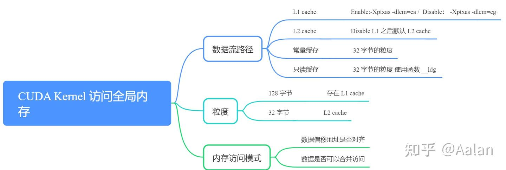
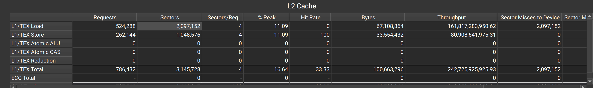

# 合并访存

## 全局内存访问模式

全局内存是一个49位的虚拟地址空间，它可以映射到设备上的物理内存、pinned system 内存或 peer 内存。全局内存对GPU中的所有线程都是可见的。全局内存通过SM的L1缓存和GPU的L2缓存进行访问.

全局内存通过缓存实现加载和存储的过程如下图：

全局内存是一个逻辑层面的模型，我们编程的时候有两种模型考虑：一种是逻辑层面的，也就是我们在写程序的时候（包括串行程序和并行程序），写的一维（多维）数组，结构体，定义的变量，这些都是在逻辑层面的；一种是硬件角度，就是一块DRAM上的电信号，以及最底层内存驱动代码所完成数字信号的处理。

cuda kernel
从 global memory 读取数据的话，数据流 DRAM -> L2 Cache -> L1 Cache(可控制)->registers（Thread）。 

L1 Cache(可控制) 的意思是，可以通过编译选项 (`-dlcm=cg`) 手动控制数据是否经过 L1 Cache，L2 Cache 是必须会使用到的。数据是无法直接从 DRAM->registers (原因是这样数据延时会非常大！) 

L1表示一级缓存，每个SM都有自己L1，但是L2是所有SM公用的，除了L1缓存外，还有只读缓存和常量缓存。


## 全局内存访问优化



基本逻辑是： **首先判断这个 Kernel 的数据流路径，是否使用了 L1 cache，由此得出当前内存访问的最小粒度： 32 Bytes / 128 Bytes. 分析原始数据存储的结构，结合访存粒度，分析数据访问是否内存对齐，数据是否能合并访问。** 

### 粒度：

- 使用 L1 cache 的话，粒度是 128 Bytes
- 不使用 L1 cache 的话，粒度是 32 Bytes

**粒度**:可以理解为最小单位，也就是核函数运行时每次读内存，哪怕是读一个字节的变量，也要读128字节，或者32字节

对于 CPU 来说，一级缓存或者二级缓存是不能被编程的，但是 CUDA 是支持通过编译指令停用一级缓存的。如果启用一级缓存，那么每次从 DRAM 上加载数据的粒度是128字节，如果不适用一级缓存，只是用二级缓存，那么粒度是32字节。 

### 合并访存

**我们把一次内存请求——也就是从内核函数发起请求，到硬件响应返回数据这个过程称为一个内存事务（加载和存储都行）。**

- 是否对齐访问

  当一个内存事务的首个访问地址是缓存粒度（32或128字节）的偶数倍的时候：比如二级缓存32字节的偶数倍64，128字节的偶数倍256的时候，这个时候被称为对齐内存访问，非对齐访问就是除上述的其他情况，非对齐的内存访问会造成带宽浪费。 

- 是否合并访问

  当一个线程束内的线程访问的内存都在一个内存块里的时候，就会出现合并访问。

对齐合并访问的状态是理想化的，也是最高速的访问方式，当线程束内的所有线程访问的数据在一个内存块，并且数据是从内存块的首地址开始被需要的，那么对齐合并访问出现了。为了最大化全局内存访问的理想状态，尽量将线程束访问内存组织成对齐合并的方式，这样的效率是最高的。

例子：

```cpp
template <typename T>
__global__ void add_kernel(T* d_vecA, T* d_vecB, T* d_vecC)
{
    auto idx = blockIdx.x * blockDim.x + threadIdx.x;

    d_vecC[idx] = d_vecA[idx] + d_vecB[idx];
}

 (int i = 0; i < 2; ++i) {
        dim3 block(64);  // N = 1024 * 1024 * 32
        dim3 grid(N / (64 * 4));
        add_kernel<<<grid, block>>>(d_vecA, d_vecB, d_vecC);
```

使用 `ncu-gui` (即 nsight compute)， 可以得到下图


下面介绍一下如何计算的：

总共线程数为 `8 * 1024 * 1024`, 每个线程执行两次 load 操作，一次 save 操作。因此实际的访问次数为 `8 * 1024 * 1024 * (2+1) = 25165824`, 又因为 GPU 是以 warp (32个线程) 为单位的，因此指令数为：`25165824 / 32 = 786432`. 因此上图中 `Kernel Instructions` 为 `786432`. 且其中有 `524288` 是 `Load` 指令 `262144` 是 `Store` 指令。 

以 `load` 的 `524288` 个指令为例，操作的是浮点数，大小为 4 bytes，加上每个 warp 32 线程，因此 L2 cache 一个指令需要查找 32 * 4 = 128 bytes，因此总共要 load `32 * 4 * 524288 = 67108864 bytes` 而因为 L2 cache 只能按 sector 查找，一个 sector 为32bytes，因此 L2 cache 要查找 `32 * 4 * 524288 / 32 = 2097152` 个 sector。nsight compute 证明了这一计算： 



上图有合并访问，因此效率较高。可以直接用 `total bytes / sector bytes` 来计算 L2 cache 的命中率。


### 非对齐合并访问

```cpp
template <typename T>
__global__ void add_kernel2(T* d_vecA, T* d_vecB, T* d_vecC)
{
    auto idx = blockIdx.x * blockDim.x + threadIdx.x + 1;

    d_vecC[idx] = d_vecA[idx] + d_vecB[idx];
}

```

\

这个时候，由于 offset+1，因此 L2在目标地址的开头或者结尾处都需要取多一个 sector，导致利用率降低。 

此时 nsight compute 会给出建议:

> **DRAM Global Load Access Pattern Est. Speedup: 15.19%**:The memory access pattern for global loads from DRAM might not be optimal. On average, only 25.6 of the 32 bytes transmitted per sector are utilized by each thread. This applies to the 92.2% of sectors missed in L2. This could possibly be caused by a stride between threads. Check the  Source Counters section for uncoalesced global loads.

> **L1TEX Global Store Access Pattern Est. Speedup: 5.28%**: The memory access pattern for global stores to L1TEX might not be optimal. On average, only 25.6 of the 32 bytes transmitted per sector are utilized by each thread. This could possibly be caused by a stride between threads. Check the  Source Counters section for uncoalesced global stores. 

> **DRAM 全局加载访问模式估计加速比：15.19%**：从 DRAM 进行全局加载的内存访问模式可能不是最优的。平均而言，每个线程仅利用了每个扇区传输的32字节中的25.6字节。这适用于在 L2中未命中的92.2%的扇区。这可能是由于线程之间的步长造成的。请查看“源计数器”部分，了解未合并的全局加载。 

> **L1TEX 全局存储访问模式估计加速比：5.28%**：对 L1TEX 进行全局存储的内存访问模式可能不是最优的。平均而言，每个线程仅利用了每个扇区传输的32字节中的25.6字节。这可能是由于线程之间的步长造成的。请查看“源计数器”部分，了解未合并的全局存储。 

由于现在 L2 对每个 warp 的一条指令需要查找5个而不是4个 sector，因此此时要查找 `32 * 5 * 524288 / 32 = 262144` 个 sector。但真正有用的是 `32 * 5 * 524288 / 32 = 2097152` 个 sector，因此 L2 cache 的命中率降低。 


### 乱序的合并访问


```cpp
template <typename T>
__global__ void add_kernel3(T* d_vecA, T* d_vecB, T* d_vecC)
{
    auto idx = blockIdx.x * blockDim.x + (threadIdx.x ^ 0x1);

    d_vecC[idx] = d_vecA[idx] + d_vecB[idx];
}
```

其中，`threadIdx.x ^ 0x1`是一种置换操作，作用是将交换相邻的两个数。线程块中的线程束依然访问0~31个元素。这样的访问是乱序的，依然只需要一个128字节的内存事务完成，合并度也为100%

在一个warp中乱序，如上图所示，并不会影响合并访问，因此上图的理论效率与 [warp-divergence](#合并访存)是相同的。

### 广播式的非合并访问


```cpp
template <typename T>
__global__ void add_kernel4(T* d_vecA, T* d_vecB, T* d_vecC)
{
    auto idx = blockIdx.x * blockDim.x + (threadIdx.x ^ 0x1);
    int warp_id = idx / 32;

    d_vecC[warp_id] = d_vecA[warp_id] + d_vecB[warp_id];
}
```

一个 warp 内的线程访问同一个元素


所有线程访问一个4字节的数据，那么此时的利用率是 4/32=12.5%

### 非对齐且不连续


```cpp
template <typename T>
__global__ void add_kernel5(T* d_vecA, T* d_vecB, T* d_vecC)
{
    auto idx = blockIdx.x * blockDim.x + (threadIdx.x ^ 0x1);

    d_vecC[idx * 4] = d_vecA[idx * 4] + d_vecB[idx * 4];
}
```

这种是最坏的情况：


可以看到，程序同样需要那么多数据，却要在硬件上加载远大于这个数的数据量。Sector数达到了16。

# 缓存

GPU 的所有单元（如执行图形计算、数据处理等任务的单元）都是通过 L2 缓存与主内存进行通信的。也就是说，当 GPU 单元需要从主内存读取数据或者将数据写入主内存时，都需要经过 L2 缓存这一环节，它在 GPU 单元和主内存之间建立了一条数据传输的通道。

L2 缓存位于芯片上内存客户端（如 GPU 的各个计算单元等）和帧缓冲区（用于存储图像数据等）之间，起到了一个中间桥梁的作用。

L2 缓存是在物理地址空间中工作的。这意味着它直接处理物理地址，而不是虚拟地址。在计算机系统中，物理地址是实际的内存地址，而虚拟地址是操作系统为程序提供的逻辑地址空间。L2 缓存使用物理地址可以更直接地管理和访问主内存中的数据，提高数据访问的效率和准确性。

L2 缓存最基本的功能是提供缓存功能。它存储了最近访问过的数据和指令，当 GPU 单元再次需要这些数据时，可以直接从 L2 缓存中快速获取，而不需要每次都去主内存中读取，从而减少了数据访问的延迟，提高了 GPU 的性能。

L2 缓存还包含用于执行压缩的硬件。数据压缩可以减少数据在缓存中的存储空间占用，使得缓存能够存储更多的数据。例如，对于一些图像数据、纹理数据等，通过压缩可以在有限的缓存空间中存储更多的图像纹理信息，当需要使用这些数据时再进行解压，这样可以提高缓存的利用率，进一步提升 GPU 的性能。

L2 缓存还支持全局原子操作。即整个 GPU 系统范围内保证操作的原子性。例如，在多线程或多单元的 GPU 环境中，当多个线程或单元需要对共享数据进行更新操作时，通过 L2 缓存的全局原子操作功能可以确保这些操作的顺序性和正确性，避免数据竞争和冲突，保证 GPU 系统的稳定运行。


如上图所示，L1缓存用来管理全局，local，shared，texture和surface内存的读和写。这也就是为什么上面的内存写的是`L1TEX`(L1 Text),其实际上包括 L1数据缓存，共享缓存，纹理缓存，而 LTS 就是 L2 缓存


由[全局内存访问优化](#全局内存访问优化)可以知道，SM通过L1->L2->DRAM 来访问GPU内存。由上图可以看到：

- L1接受来自SM的请求（global或者local memory）或者来自 TEX 的请求（texture 和 surface 请求）。
- L1将请求发送到 Tag Stages 中进行命中，如果命中，说明需要的数据在 L1 中
  - 根据请求将对应 `LSU data`(local,shared,universal) 或者 `TEX data` 直接发送给SM
- 如果未命中，说明不在 L1中，因此将请求发送给 `Miss Stage`，其将请求发送给 L2，当L2将数据送到L1时，再通过Miss Stage 将数据保存在L1缓存中，便于下次访问。

因此我们可以再回过头来看上述程序的Nsight Compute测试界面：（由于没有开启 L1 缓存，所以L1 缓存的命中率始终是0


注意在 L2缓存中的 `L1/TEX Load(Store)` 与 L1缓存中的`Loads`和 `Store` 是有差别的。

根据文档，L2缓存中的 `L1/TEX Load(Store)` 的 request 是指：_For each access type, the total number of requests made to the L2 cache. This correlates with the Sector Misses to L2 for the L1 cache. Each request accesses up to four sectors from a single 128 byte cache line._（对于每种访问类型，向 L2 缓存提出的请求总数。这与 L1 缓存对 L2 的扇区缺失相关。每个请求最多可访问单个 128 字节高速缓存行中的四个扇区）。

每个请求最多可访问单个 128 字节高速缓存行中的四个扇区，所以当没有合并访存时，会导致 L1 向 L2 请求的内存字节数要更多。

比如上面的 kernel2：


# 实例

下面以一个简单的矩阵 transpose 实例来说明 coalesce 的重要性和有效性。代码见 [colesced_paratice](coalesced_practice.cu)

**注意**：由于本章讲的是全局内存，因此例子只在全局内存中优化，并不会涉及到其他优化方式，完整且更快速地优化见 [mat_transpose_demo](../mat_transpose_demo/note.md)

实现 matrix transpose，最简单的cuda实现就是如此：

```c++
__global__ void transpose_global_32_8(const float *input, float *output, std::size_t m, std::size_t n)
{
    auto rId = threadIdx.y + blockIdx.y * blockDim.y;
    auto cId = threadIdx.x + blockIdx.x * blockDim.x;
    if (rId < m && cId < n)
        output[cId * m + rId] = input[rId * n + cId];
}
```

但是如何分配好核的数量却有讲究，在第一个例子中，我们分配如下：

```c++
constexpr std::size_t M = 2048;
constexpr std::size_t N = 512;

{

    dim3 block(32, 8);
    dim3 grid((n + block.x) / block.x, (m + block.y) / block.y);
}
```

其加载和写入内存如图所示：


写入的时候，一行刚好可以由一个warp执行，而一行读取是连续的32个float，而一个sector 256 bits是8个浮点数大小，因此一行刚好可以利用4个sector，且能充分利用sector中的所有数据。

但是在写入的时候，由于写入的不是连续的地址，因此写入32行，就要32个sector，每个sector只有一个浮点数要被利用到，导致写入的时候sector的利用率只有 1/8。

nsight compute的介意也给出了这一点：

> The memory access pattern for global stores to L1TEX might not be optimal. On average, **only 4.0 of the 32 bytes** transmitted per sector are utilized by each thread. This could possibly be caused by a stride between threads. Check the  Source Counters section for uncoalesced global stores.


因此我们可以修改一下block的尺寸，改成：`(16,16)`


此时读取依然可以是4个sector，而写入变成了16个sector，且一个sector有2个数据是有用的，数据利用率提升了1倍。


再一步优化，我们可以把block改成 `(8,32)`, 此时读取依然是连续的，而每一个sector有4个数据可用，数据利用率再次提升。

下面是三种方案的计算时间，可以看到，基本上呈现x2的速度：


在换一种思考，让一个线程处理多个数据，而不是多个数据，我们让一个线程读取 $4 \times 4$ 个二维数据，在线程的寄存器中直接对其进行转置，再将转置后的数据写会全局内存中，这样即使我们的核是 `32 x 8`, 由于写入的时候是 `4x4`写入，一行有4四个连续数据，而一个sector有8个连续float，因此可以达到 50%的利用率，如果我们将 blockSize 替换成：`16 x 16`, 则此时理论上无论读取还是写入，sector中的所有数据都能被利用到：

```c++
template <typename T>
__device__ constexpr auto &fetch_vec4(T *ptr)
{
    using DecayType = std::remove_cv_t<std::remove_reference_t<T>>;
    return reinterpret_cast<std::conditional_t<std::is_const_v<T>, const float4, float4> *>((ptr))[0];

}
__global__ void transpose_global_4x4(const float *input, float *output, std::size_t m, std::size_t n)
{
    auto colIdx = (blockIdx.x * blockDim.x + threadIdx.x) << 2;
    auto rowIdx = (blockIdx.y * blockDim.y + threadIdx.y) << 2;
    if (colIdx >= n || rowIdx >= m)
    {
        return;
    }
    float4 srcVec4[4];
    float4 dstVec4[4];

    // 读取
    srcVec4[0] = fetch_vec4(input + rowIdx * n + colIdx);
    srcVec4[1] = fetch_vec4(input + (rowIdx + 1) * n + colIdx);
    srcVec4[2] = fetch_vec4(input + (rowIdx + 2) * n + colIdx);
    srcVec4[3] = fetch_vec4(input + (rowIdx + 3) * n + colIdx);

    // transpose 
    dstVec4[0] = make_float4(srcVec4[0].x, srcVec4[1].x, srcVec4[2].x, srcVec4[3].x);
    dstVec4[1] = make_float4(srcVec4[0].y, srcVec4[1].y, srcVec4[2].y, srcVec4[3].y);
    dstVec4[2] = make_float4(srcVec4[0].z, srcVec4[1].z, srcVec4[2].z, srcVec4[3].z);
    dstVec4[3] = make_float4(srcVec4[0].w, srcVec4[1].w, srcVec4[2].w, srcVec4[3].w);

    // 写回
    fetch_vec4(output + colIdx * m + rowIdx) = dstVec4[0];
    fetch_vec4(output + (colIdx + 1) * m + rowIdx) = dstVec4[1];
    fetch_vec4(output + (colIdx + 2) * m + rowIdx) = dstVec4[2];
    fetch_vec4(output + (colIdx + 3) * m + rowIdx) = dstVec4[3];
}
```

```c++
    dim3 block(32, 8);
    const std::size_t TildeSize = 4;
    dim3 grid((n + block.x * TildeSize - 1) / (block.x * TildeSize), (m + block.y * TildeSize - 1) / (block.y * TildeSize));
    transpose_global_4x4<<<grid, block>>>(d_input.data, d_output.data, m, n);
```

下列是核分别为 `32x8, 16x16, 8x32`时的运算时长，最上面是采用单一线程单一元素时，block为 `8x32` 的时长，可以看到，采用这种方法后，`8x32, 16x16` 都比单一映射下的 `8x32` 要快：


而对于 `16x16`, 更有


达到了sector百分之百的利用率

---

# 参考资料

- [CUDA笔记 内存合并访问](https://zhuanlan.zhihu.com/p/641639133)
- [CUDA 全局内存访存优化](https://zhuanlan.zhihu.com/p/675186810)
