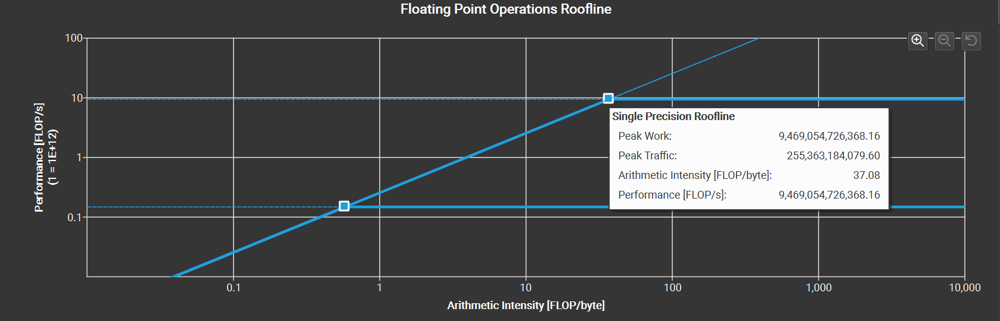

# Roofling Model

在真实世界中，任何模型（例如 VGG / MobileNet 等）都必须依赖于具体的计算平台（例如 CPU / GPU / ASIC 等）才能展现自己的实力。此时，模型和计算平台的"默契程度"会决定模型的实际表现。**Roofline Model 提出了使用 Operational Intensity（计算强度）进行定量分析的方法，并给出了模型在计算平台上所能达到理论计算性能上限公式。**

- **算力** $\pi$  ：也称为计算平台的**性能上限**，指的是一个计算平台倾尽全力每秒钟所能完成的浮点运算数。单位是 `FLOPS` or `FLOP/s`。

$$\pi : \text{Maximum FLOPs Per Second}$$ 

- **带宽** $\beta$  ：也即计算平台的**带宽上限**，指的是一个计算平台倾尽全力每秒所能完成的内存交换量。单位是 `Byte/s`。

$$\beta : \text{Maximum Memory Access Per Second}$$ 

- **计算强度上限 $I_{m a x}$ ** ：两个指标相除即可得到计算平台的**计算强度上限**。它描述的是在这个计算平台上，单位内存交换最多用来进行多少次计算。单位是 `FLOPs/Byte`。

$$I_{m a x} = \frac{\pi}{\beta}$$ 

> **注**：这里所说的“内存”是广义上的内存。对于 CPU 计算平台而言指的就是真正的内存；而对于 GPU 计算平台指的则是显存。

比如 RTX4060：

| Theoretical Performance |                     |
| ----------------------- | ------------------- |
| FP16 (half)             | 15.11 TFLOPS (1:1)  |
| FP32 (float)            | 15.11 TFLOPS        |
| FP64 (double)           | 236.2 GFLOPS (1:64) |
| Bandwidth               | 272.0 GB/s          |

因此理论计算强度上限为：`55.55 FLOPs/Byte`

## 模型(或者核函数)的两个指标：计算量与访存量

- **计算量：** 指的是输入单个样本（对于 CNN 而言就是一张图像），模型进行一次完整的前向传播所发生的浮点运算个数，也即模型的**时间复杂度**。单位是 `FLOP` or `FLOPs`。其中卷积层的计算量公式如下：

$$
\text{Conv Layer Time Complexity} : M^{2} \cdot K^{2} \cdot C_{i n} \cdot C_{o u t} \left(\right. \text{FLOPS} \left.\right)
$$  

- **访存量：** 指的是输入单个样本，模型完成一次前向传播过程中所发生的内存交换总量，也即模型的**空间复杂度**。在理想情况下（即不考虑片上缓存），模型的访存量就是模型各层权重参数的内存占用（Kernel Mem）与每层所输出的特征图的内存占用（Output Mem）之和。单位是 `Byte`。由于数据类型通常为 `float32` ，因此需要乘以四。

$$
\text{Conv Layer Space Complexity} : \left(\right. K^{2} \cdot C_{i n} \cdot C_{o u t} + M^{2} \cdot C_{o u t} \left.\right) \cdot 4 \left(\right. \text{Bytes} \left.\right)
$$

- **模型的计算强度 $I$ **  :  由计算量除以访存量就可以得到模型的计算强度，它表示此模型在计算过程中，每 `Byte` 内存交换到底用于进行多少次浮点运算。单位是 `FLOPs/Byte`。可以看到，模型计算强度越大，其内存使用效率越高。

  

- **模型的理论性能 $P$  ：** 我们最关心的指标，即模型 *在计算平台上* 所能达到的每秒浮点运算次数（理论值）。单位是 `FLOPS` or `FLOP/s`。下面我们即将介绍的 Roof-line Model 给出的就是计算这个指标的方法。终于可以进入正题了。

## Roof-line Model

  

其实 Roof-line Model 说的是很简单的一件事：**模型在一个计算平台的限制下，到底能达到多快的浮点计算速度**。更具体的来说，Roof-line Model 解决的，是“**计算量为 A 且访存量为 B 的模型在算力为 C 且带宽为 D 的计算平台所能达到的理论性能上限 E 是多少**”这个问题。
  

所谓“Roof-line”，指的就是由计算平台的算力和带宽上限这两个参数所决定的“屋顶”形态，如下图所示。

- **算力**决定“屋顶”的高度（绿色线段）
- **带宽**决定“房檐”的斜率（红色线段）

### 3.2 Roof-line 划分出的两个瓶颈区域

$$
P=
\begin{cases}
\beta\cdot I, & when & I<I_{max} & \text{Memory Bound}\\
 \\
\pi, & when & I\geqslant I_{max} & \text{Compute Bound} & 
\end{cases}
$$

## 例子

假设一个显卡的峰值算力为 `2 FLOPS`, 而带宽为 `5 Byte/s`, 因此其计算强度上限位 `0.4 FLOPs/Byte`.

现在有一个kernel，其访存量为 50B，计算量为 10 次。

如果完全串行，即先进行内存访问，然后进行计算，则内存访问需要 50/5 = 10s，而计算需要 10/2 = 5s。因此总共用时 15 s。

因此实际算力 10/15 FLOPS，实际的带宽为 50 / 15 Byte/s, 而实际的计算强度（与时间无关）为 10/50=0.2 FLOPs/Byte

而实际上CUDA要做的就是通过并行化来掩盖内存访问，如图所示：

此时运行时间为 11s，因此实际算力为 10/11 FLOPS，实际的带宽为 50/11 Byte/s，而计算强度依然是 0.2.

相当于在 Roofline 模型示意图中，其横坐标未变，但是纵坐标上升了，对应的斜率也上升了。

## Nsight System

可在 Nsight System 中的 GPU Speed Of Light Throughput 一栏中看到自己的核函数达到的性能。（本人 GPU 被阉割得挺惨）

